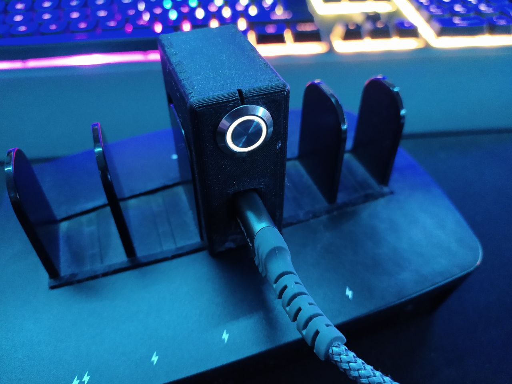

# Wled_Ringer
A Wled hotkey that changes presets like a doorbell 

## How to use
this is written for a wwmos d1 mini. 

1. set ssid and pw
2. set ip of your wled device in Line 33 and 35
3. connect a button to pin 5 and gnd
4. connect  a led to pin 5 and gnd
5. done

## 3D Print

the STLs are for a phone charging station:

